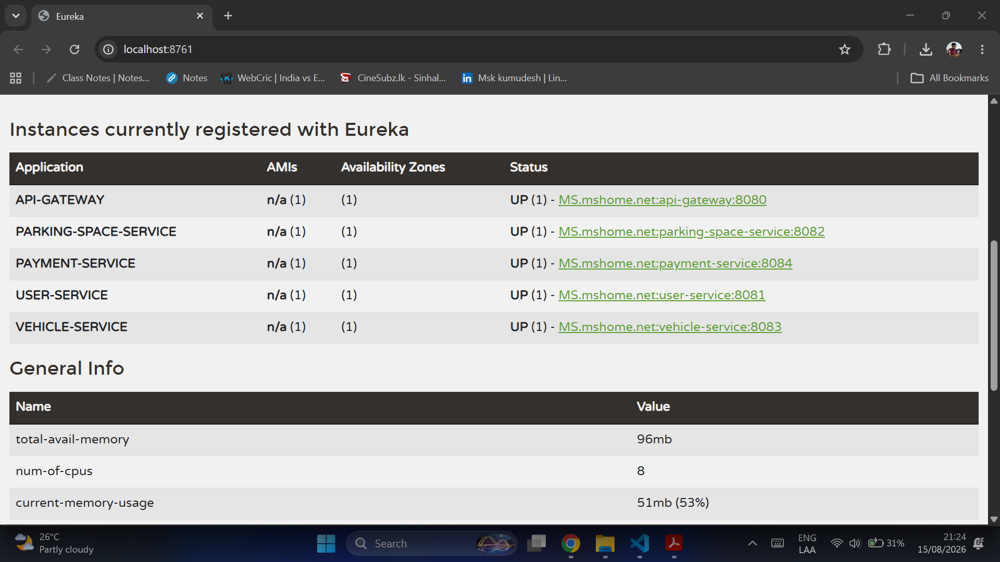

# Smart Parking Management System (SPMS)

A cloud-native, microservice-based platform for real-time parking discovery, reservation, vehicle
tracking, and mock payments — built for **ITS 1018: Software Architectures & Design Patterns II**.

## Resources

- [Postman Collection](./postman_collection.json)
- 

## Architecture

```
                         ┌───────────────────────┐
                         │   API Gateway :8080   │  <- single entry point
                         └───────────┬───────────┘
              ┌────────────┬─────────┼─────────┬────────────┐
              ▼            ▼         ▼         ▼            ▼
        User Service  Parking Space  Vehicle  Payment
           :8081        Service     Service   Service
                          :8082      :8083     :8084
              │            │         │         │
              └────────────┴────┬────┴─────────┘
                                 ▼
                    ┌─────────────────────────┐
                    │  Eureka Server  :8761    │  <- service registry
                    │  Config Server  :8888    │  <- centralized config
                    └─────────────────────────┘
```

- **Eureka Server** — service registry; every service registers on boot and discovers peers by
  name instead of hardcoded host/port.
- **Config Server** — serves per-service YAML (ports, Eureka URL, datasource, business flags)
  from `config-server/src/main/resources/config-repo`, so config can change without redeploying.
- **API Gateway** — the only service exposed to clients; routes `/api/users/**`,
  `/api/parking/**`, `/api/vehicles/**`, `/api/payments/**` to the right backend via Eureka's
  load balancer (`lb://SERVICE-NAME`).
- **User Service** — registration, login, profiles, booking history.
- **Parking Space Service** — space CRUD, search/filter, status updates (manual or simulated
  IoT), reservations. Calls Vehicle Service via **Feign** to confirm a vehicle exists before
  confirming a reservation — a real example of service-to-service communication.
- **Vehicle Service** — vehicle registration, entry/exit simulation, logs.
- **Payment Service** — mock payment gateway (Luhn-checks card numbers, validates expiry),
  transaction records, refunds, digital receipts.

Each business service owns its own in-memory H2 database — no shared database, consistent with
microservice principles. Data resets on restart, which is expected for a coursework demo.

## Tech Stack

| Layer | Technology |
|---|---|
| Services | Spring Boot 3.2.5, Java 17 |
| Discovery | Spring Cloud Netflix Eureka |
| Config | Spring Cloud Config Server (native profile) |
| Gateway | Spring Cloud Gateway |
| Inter-service calls | Spring Cloud OpenFeign |
| Persistence | Spring Data JPA + H2 (in-memory) |
| Build | Maven (independent module per service) |
| Testing | Postman |
| Containerization | Docker + Docker Compose (optional) |

## Project Structure

```
spms/
├── README.md
├── postman_collection.json
├── docker-compose.yml
├── docs/screenshots/
├── config-server/            # centralized config (native profile)
│   └── src/main/resources/config-repo/   # per-service YAML
├── eureka-server/            # service registry
├── api-gateway/              # single entry point + routing
├── user-service/             # users, auth, booking history
├── parking-space-service/    # spaces, availability, reservations
├── vehicle-service/          # vehicles, entry/exit tracking
└── payment-service/          # mock payments, receipts
```

Each service follows the same internal layout:
`controller/ → service/ → repository/ → entity/`, plus `dto/` for request/response shapes and
`exception/` for a `@RestControllerAdvice` global error handler returning a consistent JSON
error shape (`timestamp`, `status`, `error`, `message`, `path`, and `fieldErrors` for validation
failures).

## Running the Project

### Option A — Maven, one service per terminal (recommended for development)

Start in this order — Config Server and Eureka first, everything else after:

```bash
cd config-server        && mvn spring-boot:run     # :8888
cd eureka-server        && mvn spring-boot:run     # :8761
cd api-gateway          && mvn spring-boot:run     # :8080
cd user-service         && mvn spring-boot:run     # :8081
cd parking-space-service && mvn spring-boot:run    # :8082
cd vehicle-service      && mvn spring-boot:run     # :8083
cd payment-service      && mvn spring-boot:run     # :8084
```

Give Config Server + Eureka ~10–15 seconds to be ready before starting the rest; each business
service retries registration automatically if it starts too early.

### Option B — Docker Compose (one command)

```bash
docker compose up --build
```

This builds and starts all seven services with the correct dependency order (`depends_on`).
Ports are published to the host exactly as above.

## Testing

1. Import [`postman_collection.json`](./postman_collection.json) into Postman.
2. All requests go through the Gateway at `http://localhost:8080` — Postman never talks to a
   business service directly, matching the real routing path.
3. Suggested flow: **Register Owner → Register Driver → Login → Create Parking Space → Register
   Vehicle → Reserve Space → Simulate Entry → Initiate Payment → Simulate Exit → Release
   Reservation → Get Receipt.**
4. Each folder also includes `[Error case]` requests (duplicate email, reserving an unavailable
   space, invalid card number, exiting without an open entry, etc.) to demonstrate error handling.


## API Overview

Full request/response bodies are in the Postman collection; endpoints summarized here.

**User Service** (`/api/users`)
`POST /register` · `POST /login` · `GET /{id}` · `PUT /{id}` · `DELETE /{id}` ·
`GET ?role=` · `POST /{id}/history` · `GET /{id}/history`

**Parking Space Service** (`/api/parking`)
`POST /spaces` · `GET /spaces?city=&zone=&status=` · `GET /spaces/{id}` · `PUT /spaces/{id}` ·
`PATCH /spaces/{id}/status` · `DELETE /spaces/{id}` · `GET /owners/{ownerId}/spaces` ·
`POST /spaces/{id}/reserve` · `POST /reservations/{id}/release` ·
`GET /spaces/{id}/reservations`

**Vehicle Service** (`/api/vehicles`)
`POST /` · `GET /{id}` · `GET /{id}/exists` · `PUT /{id}` · `DELETE /{id}` ·
`GET /user/{userId}` · `POST /{id}/entry` · `POST /{id}/exit` · `GET /{id}/logs`

**Payment Service** (`/api/payments`)
`POST /` · `GET /{id}` · `GET /user/{userId}` · `POST /{id}/refund` · `GET /{id}/receipt`

## Design Notes

- **Config strategy**: native filesystem-backed Config Server rather than a Git-backed one —
  simpler to demo, still satisfies "centralized configuration, no redeploy needed" since editing
  a file under `config-repo/` and restarting only that client picks up the change.
- **Simulated IoT**: `PATCH /api/parking/spaces/{id}/status` is the hook — hitting it on a timer
  (Postman Runner, cron, or a small script) emulates real-time sensor updates without needing
  actual hardware.
- **Mock payments**: card payments run a real Luhn checksum and expiry-format check so
  success/failure is deterministic and testable, without calling a real processor.
- **IDs, not shared tables**: services reference each other only by ID (`spaceId`, `vehicleId`,
  `reservationId`, `userId`). Cross-service reads happen over REST (see the Feign example in
  Parking Space Service), never through a shared database.
- **Auth**: login issues a simple demo token (not a real JWT) — sufficient for Postman-driven
  testing of a coursework backend; call this out explicitly if graded on security depth.
